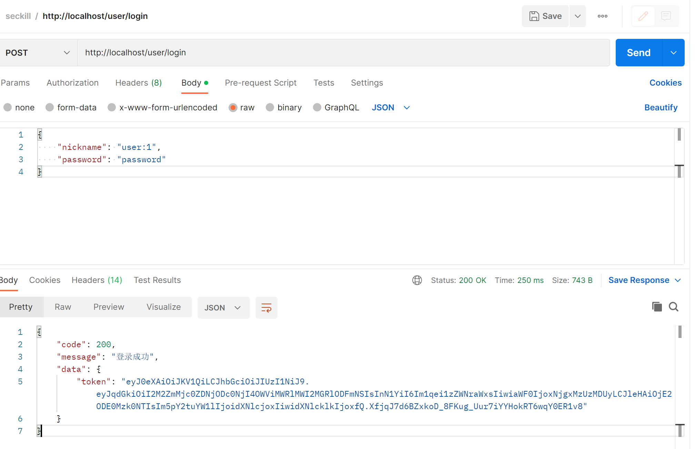
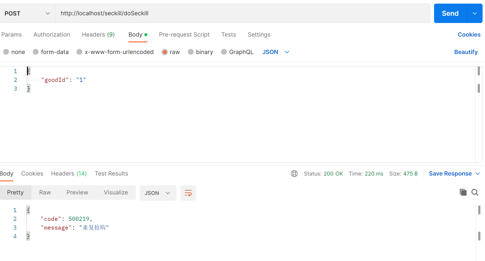

# 分布式秒杀系统
本系统重在于秒杀功能，没有实现前端，用PostMan代替浏览器发送请求
## 开发环境

JDK1.8、Maven、Mysql、IntelliJ IDEA、SpringBoot2.6.13、redis-2.8.4、mybatis-plus、SpringSecurity、RabbitMQ

## 启动说明

- 启动前 请配置 application.yml 中相关redis、RabbitMQ以及Mysql相关配置，建议在Linux下安装使用。

- 数据库脚本位于  src/main/resource/sql 下面，启动前请自行导入。

- 批量生成用户 src/main/java/com/lanan/mjzseckill/utils/UserUtil.java 用于压测，代码简单，有些东西需要改一下参数

- 配置完成，运行Application中的main方法，访问http://localhost/seckill/test 进行API测试。

- 本测试案例单纯为了学习，某些案例并不适用于生产环境，大家根据所需自行调整。

## 测试入口
PostMan 进行简单功能测试

登录获取token：http://localhost/user/login

携带token秒杀：http://localhost/seckill/doSeckill

Jmeter进行压测 src/main/resources/jmeter下有个jmx文件，把文件拖到jmeter中 可以当样例

## 友情提示

由于工作原因，项目正在完善中（仅供参考）

#### 项目介绍

SpringBoot开发案例从0到1构建分布式秒杀系统，项目案例基本成型，逐步完善中。

## 秒杀场景

多个用户在同时抢购一件或者多件商品，一个用户用脚本疯狂下单

## 秒杀架构
开局一张图，代码全靠编

#### 优化思路

- 流量分流、流量限流

- 缓存

- 异步

#### 分层优化

- 前端优化：活动开始前生成静态商品页面推送缓存和CDN，静态文件(JS/CSS)请求推送至文件服务器和CDN。
    秒杀按钮置灰、链接隐藏、请求URI随机、验证码
- 后端优化：限制重复下单、内存标记、库存预减、lua、缓存重建、MQ异步下单

## 思考改进

- 如何防止单个用户重复秒杀下单？
- 如何防止恶意调用秒杀接口？
- 如果用户秒杀成功，一直不支付该怎么办？
- 消息队列处理完成后，如果异步通知给用户秒杀成功？
